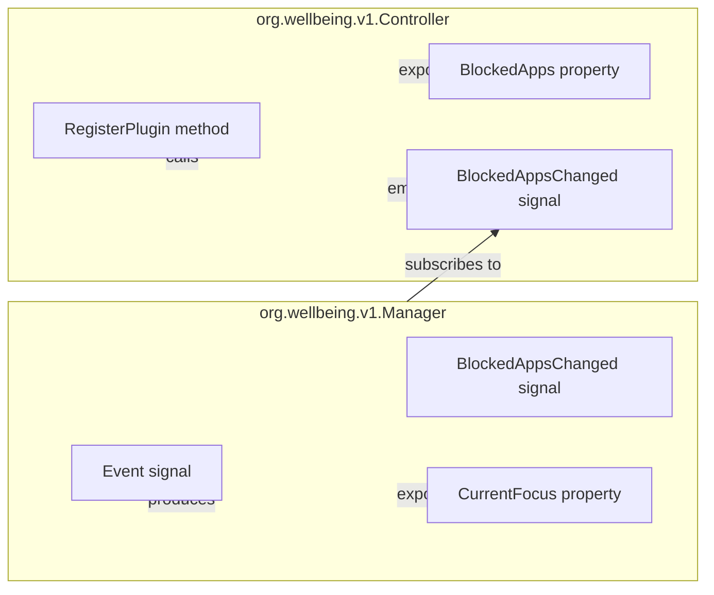
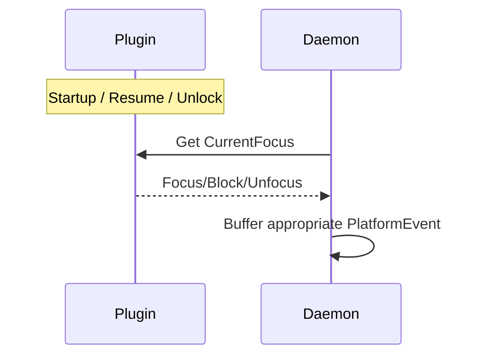
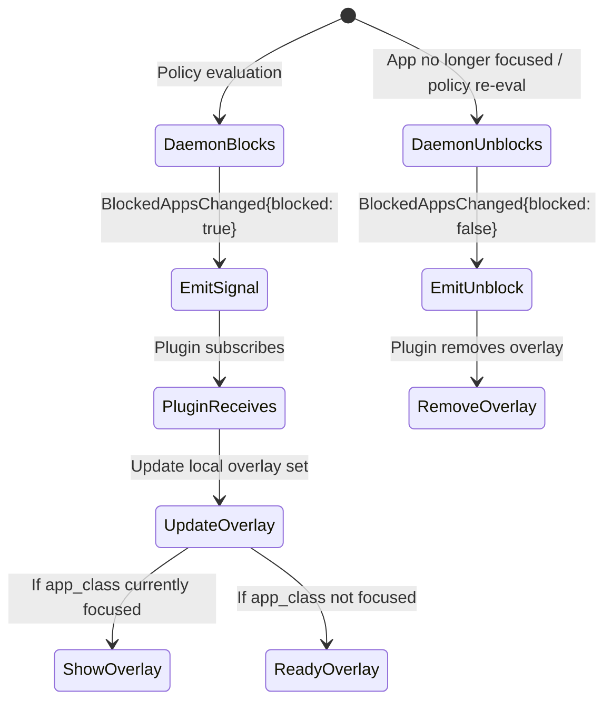
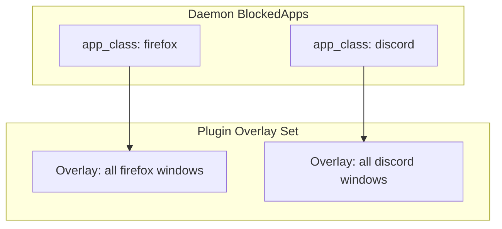
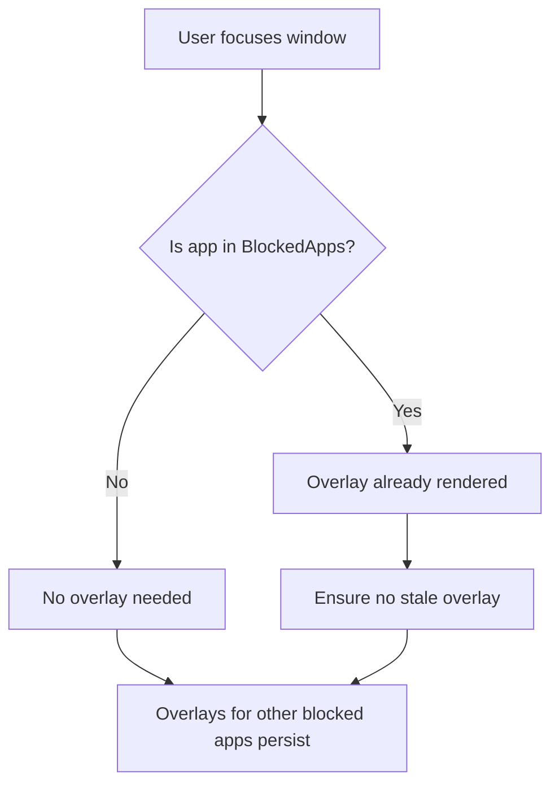
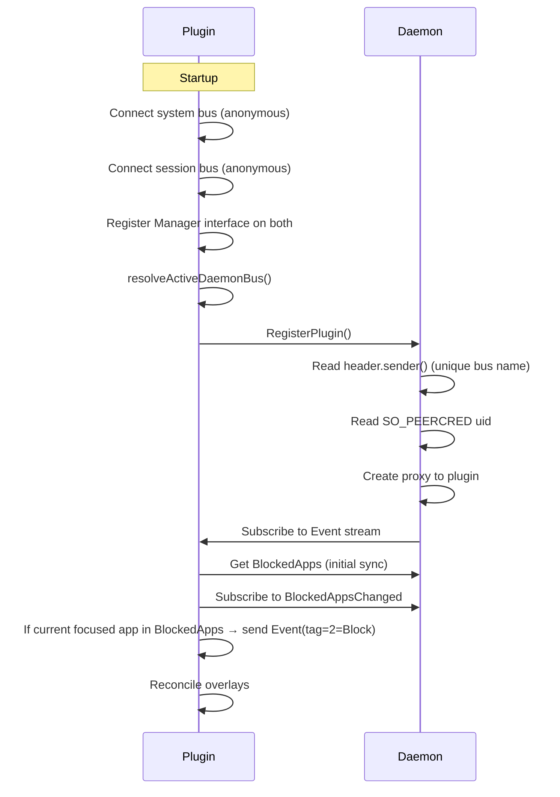
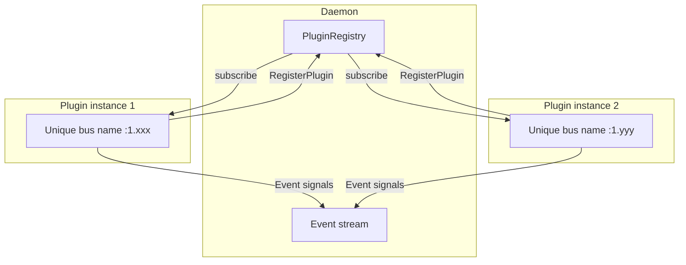
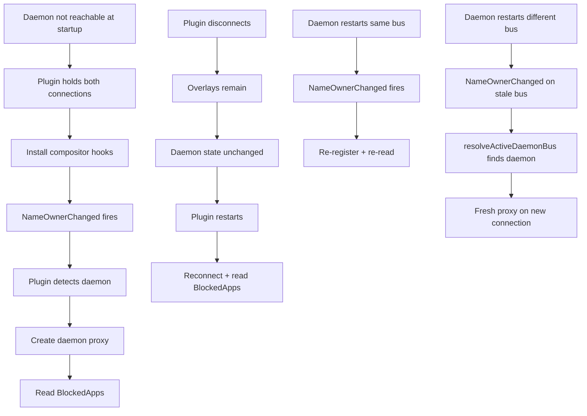

# Plugin IPC (D-Bus)

The daemon and GUI communicate with the compositor plugin over the daemon's bus
— the system bus when the daemon runs in system mode (root), the session bus
when it runs in session mode (non-root). See
[13-deployment-modes.md](./13-deployment-modes.md) for bus/scope selection.

The architecture is declarative: the daemon exposes its block state as a
readable data source, and the plugin reads that state to decide when to show or
hide overlays. The daemon never commands the plugin — it only publishes state.

Plugin bus resolution uses the same 4-step algorithm as the GUI
([13-deployment-modes.md](./13-deployment-modes.md#plugin-resolution)): the
plugin connects to both system and session busses permanently, then selects
which connection hosts the daemon (system present -> session present -> activate
system -> activate session). This guarantees exactly one enforcing daemon per
user while enabling cross-bus daemon restart recovery.

No compositor detection, no socket path configuration, no feature gates.

## D-Bus Interface — org.wellbeing.v1.Manager

The plugin exposes a single interface with signals and a property. It has no
method for the daemon to call — the daemon never commands the plugin. The plugin
is a pure producer of window-domain facts (focus, activity, user clicks) and a
consumer of daemon block state.



Signals (plugin -> daemon):

| Signal | Payload                                                                                                                                                 | When                                                   |
| ------ | ------------------------------------------------------------------------------------------------------------------------------------------------------- | ------------------------------------------------------ |
| Event  | (u32, String, String, u32) — (tag, app_class, title, power_tag); tag=0=Focus, tag=1=Unfocus, tag=2=Block; power_tag encodes idle/resume/power | On every compositor focus switch and idle state change |

Property (readable):

| Property     | Type | Returns                                                                           |
| ------------ | ---- | --------------------------------------------------------------------------------- |
| CurrentFocus | v    | Same tag encoding as Event signal — Focus (tag=0), Unfocus (tag=1), Block (tag=2) |

Close button handling is entirely local to the plugin. The plugin calls
`LockManager::hideOverlay()` to dismiss the overlay without sending any signal
to the daemon.

### CurrentFocus property

D-Bus signals are fire-and-forget — they do not persist their last value, so a
client that subscribes after the fact misses the current state. CurrentFocus is
a readable D-Bus property that returns the same tag encoding as the Event
signal, giving clients a queryable, always-current source of truth on startup.
The signal remains useful as a lightweight change notification.

The daemon also uses CurrentFocus after termination events (suspend, lock,
logout) to resync focus tracking. On resume (if screen unlocked), screen unlock,
or login, the daemon queries each registered plugin's CurrentFocus property and
buffers the appropriate event — Focus, Block, or Unfocus (when the property
returns Unfocus). This restores tracking without waiting for a compositor focus
switch.



## Declarative Block State — org.wellbeing.v1.Controller

The daemon exposes the current set of blocked apps on its own interface. The
plugin discovers this state by two complementary mechanisms:

1. BlockedApps property — readable at any time. Returns all currently blocked
   apps with their block details (policy_id, reason, blocked_since,
   available_actions). The plugin reads this on startup, on reconnect, and
   periodically for reconciliation.
2. BlockedAppsChanged signal — emitted whenever a block is added or removed for
   an app. The plugin subscribes to this signal for low-latency state updates
   without polling.



Discovery flow:

```mermaid
flowchart LR
    A[EnforcerActor] -->|1. policy evaluation| B[BlockedApps state]
    B -->|2. BlockedAppsChanged signal| C[Compositor plugin]
    C -->|3. read property| B
    C -->|4. render overlay| D[Blocked window]
    E[User focus change] -->|5. Event signal| A
    F[User clicks Close] -->|6. hideOverlay() locally| C
```

## Per-App Multi-Overlay Model

Blocking enforcement is keyed by app_class, never by window. The daemon is
window-count agnostic: it writes one entry per app_class to BlockedApps. Whether
the app has one window or fifty, the entry covers all windows.



The plugin treats every window of the app_class as a single logical surface.
When an app_class appears in BlockedApps, the plugin renders a block overlay
over every window owned by the app and traps both mouse and keyboard input on
each blocked window. The overlay presents the daemon-specified action buttons
(available_actions).

Multiple distinct apps can be blocked at the same time. The plugin tracks an
unordered set of active overlays keyed by app_class, populated entirely from
daemon state (not from commands).

Overlay lifetime: an overlay persists until the daemon removes the app from
BlockedApps. Focus state does not affect overlay visibility — a blocked app's
overlay remains displayed even when another window is focused. This prevents
race conditions where a focus change causes the overlay to flicker or disappear.

### Focus handling



The plugin never hides an overlay because focus moved away. Only a daemon
BlockedAppsChanged {blocked: false} or a user action that resolves the block
triggers overlay removal.

## Idle Detection

Idle/Resume are produced by the compositor plugin, not logind. The plugin tracks
user activity (keyboard, mouse, touchpad, and video-player playback) and exposes
it via the unified Event D-Bus signal on org.wellbeing.v1.Manager. The daemon
subscribes and maps Idle -> Idle (pause), Resume -> Resume (unpause)
PlatformEvents.

```mermaid
flowchart LR
    A[User activity] --> B[Plugin idle tracker]
    B -->|idle threshold exceeded| C[Event(Idle)]
    B -->|activity resumes| D[Event(Resume)]
    C --> E[Daemon pauses interval]
    D --> F[Daemon resumes interval]
```

Tracked time includes idle spans. Idle/Resume only affect the GUI's idle
breakdown display, not daily usage or limit enforcement.

Key points:

- Idle/Resume carry no app_class; the app they pause is the open interval from
  the most recent Focus.
- Idle is the ONLY event that pauses an interval. Suspend/lock/logout/shutdown
  CLOSE it instead (see
  [03-linux-platform.md](./03-linux-platform.md#power--session-state-handling)).
- The plugin is responsible for idle debounce (e.g. a min-dwell before emitting
  Idle) so brief input gaps don't create noise segments.

## Plugin Registration (Reverse Discovery)

Each plugin instance connects to both system and session D-Bus busses
permanently at startup. The org.wellbeing.v1.Manager interface is registered on
both connections so the daemon can reach the plugin from either bus. The plugin
then runs resolveActiveDaemonBus() and calls Controller.RegisterPlugin() on the
resolved connection.

If the daemon is not reachable at startup, the plugin still holds both D-Bus
connections and installs its compositor hooks immediately. NameOwnerChanged
watchers on both connections provide event-driven notification when the daemon
appears — no polling needed.

The daemon identifies the plugin by the unique bus name (header.sender(), a
:1.xxx name assigned by the bus daemon) rather than a well-known name. Plugins
do not claim a well-known name — they connect anonymously (on both busses the
plugin holds an anonymous connection).

The daemon learns the caller's real identity from SO_PEERCRED
(kernel-authenticated uid).



On `BlockedAppsChanged`, the plugin checks its currently focused window:

- If the focused app is now in `BlockedApps` → **immediately** sends
  `Event(tag=2=Block)` for that app (no focus switch needed). This catches the
  case where a per-minute tick detects TimeLimit expiry during continuous use.
- If the focused app was removed from `BlockedApps` → sends `Event(tag=0=Focus)`
  for that app (re-opens normal tracking).

On disconnect, overlays on the compositor remain as-is (the plugin process
disappears with its compositor hooks). When the plugin reconnects, it reads
BlockedApps afresh and re-establishes all overlays.

## Multi-Instance Plugin Support

Each plugin instance reads the same BlockedApps property from the daemon. There
is no per-instance command routing. The daemon tracks each connected plugin by
its unique bus name, subscribes to its signals, and routes events into the
platform event stream. When a plugin disconnects, its subscriptions are dropped
and enforcement for that uid pauses until a new registration arrives.



Each plugin instance is responsible for showing overlays only for apps owned by
its user (the uid determined at registration via SO_PEERCRED). The daemon
includes the target uid in each BlockedApps entry, and the plugin filters
accordingly.

## Data Flow Summary

```mermaid
flowchart LR
    A[EnforcerActor] -->|1. policy evaluation| B[BlockedApps state]
    B -->|2. BlockedAppsChanged signal| C[Compositor plugin]
    C -->|3. read property| B
    C -->|4. render overlay| D[Blocked window]
    E[User focus change] -->|5. Event signal| A
    F[User clicks Close] -->|6. hideOverlay() locally| C
```

## Degraded Operation

If the daemon is not reachable at startup, the plugin still holds both D-Bus
connections and installs all compositor hooks immediately. NameOwnerChanged
watchers on both busses provide event-driven notification — no polling. When the
daemon appears on either bus, the plugin detects it, creates the daemon proxy,
and reads BlockedApps.

If the plugin disconnects (crashes), BlockedApps still exists on the daemon —
the daemon's state machine operates independently of plugin connectivity. When
the plugin restarts, it connects to both busses, resolves the daemon, reads
BlockedApps, and shows overlays for all currently blocked apps. No block state
is lost during a plugin restart.

If the daemon restarts on the same bus, the plugin's NameOwnerChanged watcher
fires, it re-registers and re-reads BlockedApps.

If the daemon restarts on a different bus (e.g., system daemon crashed and
session daemon started), the plugin's NameOwnerChanged watcher on the stale bus
fires, resolveActiveDaemonBus() detects the daemon on the other bus, and the
plugin creates a fresh daemon proxy on that connection. Recovery is transparent
— no polling, no plugin restart needed.


